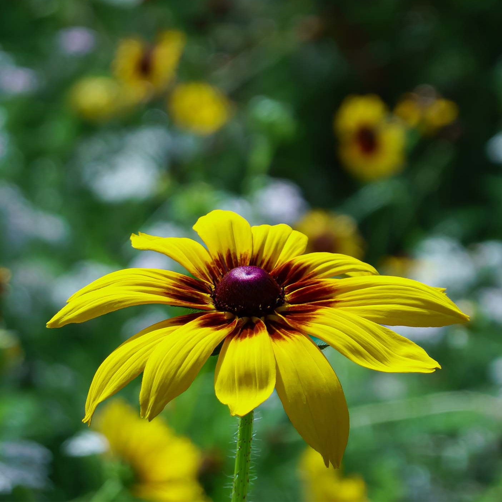

Ah yes, a botanical garden. Always a good spot to take photos (not so good to steal chips from people though). I've always liked hanging out here because I could meet my other bird friends as well. Honestly, I think this is my favourite spot in the city. I can't wait to show you why. *squawks

Let's start small.

## Flowers

## Bugs

So far, I could only see bees! Will take a closer look next time!

## Seagulls

Yes, I have a whole section dedicated to seagulls, and seagulls only!

## Other birds

It was also nice to see other bird pals around the garden!

