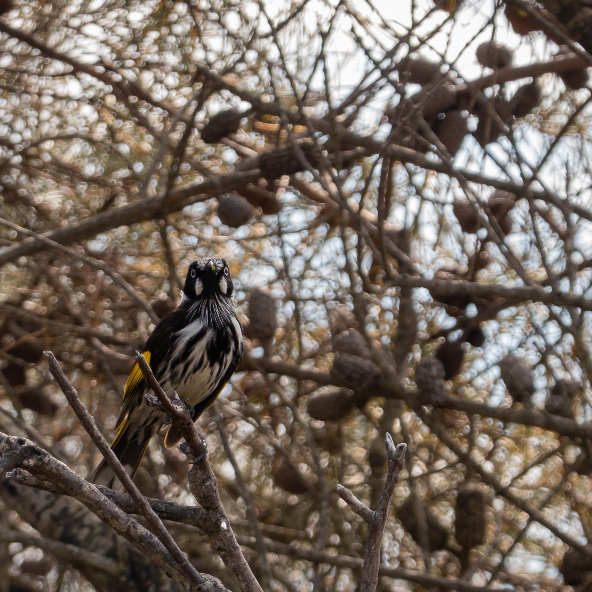

A coastal trail is always a treat for me, mainly because I get to observe hikers in their most vulnerable state (most of the time!) as they huff and puff to walk from one point to another. Sometimes I don't understand why they forget to hydrate; there's water everywhere you look! But then again, they can't fly! *squawks

# The beginning

Too tired to fly, we decided to use the ferry to get to the start of the trail.

\

Met a friendly kookaburra along the way. Tried to imitate its laughter but ended up embarrassing myself (I am a seagull after all!).

\

Yummy bird feeders (left); tempting but I was on a diet (top); flowers along the way (above and below).

&nbsp;

# Friends along the way

I forgot to mention that some of my closest buds live around this area!

Bumped into my good friend cockatoo, minding their own business.

\

A New Holland Honeyeater, looking at me suspiciously.

\

Also met Maggie along the way! Nice to see her thriving here; she can be a bit grumpy sometimes.

# The trail begins

Ah yes, this is where most humans (and me apparently) begin their journey.

